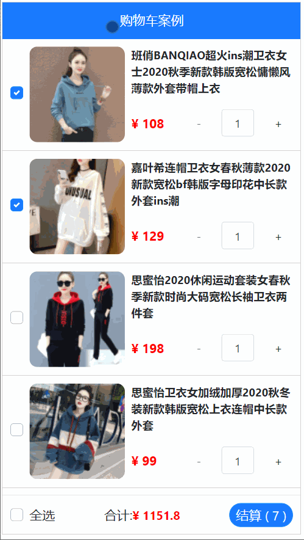

​      
## 购物车项目

>
>
>// 目标1: 自定义头部
>// 1.1 在 MyHeader 中定义 props
>// 1.2 在 props 中加一些限制条件(类型/默认值/必选项)
>// 1.3 子组件中使用这些数据
>// 1.4 父组件中传入这些数据, 根据需求来传递(标题内容/文字颜色/背景色)
>
>// 目标2: 获取数据(已经完成)
>// 2.1 下包, 在 main.js 中引入
>// 2.2 设置 baseURL
>// 2.3 将 axios 挂载到 Vue 的原型上
>// 2.4 在 App.vue 中 created 时调用全局属性 this.$http, 请求 /api/cart
>
>// 目标3: 渲染数据
>// 3.1 App.vue 中将获取的数据保存到 data 中
>// 3.2 使用 v-for 循环渲染 MyGoods 组件
>// 3.3 循环时将循环的数据传递给 MyGoods (父传子)
>// 3.4 子组件接收到数据后, 使用即可
>
>// 目标4: 勾选状态处理
>// 4.1 在 MyGoods.vue 中双向绑定 goods_state 给复选框
>// 4.2 动态绑定 id 给复选框
>// 4.3 动态绑定相同的 id 给 label 的 for 属性
>
>// 目标5: 商品数量
>// 5.1 将 goods 从 MyGoods.vue 中传给 MyCount.vue (建议直接传对象, 否则数据同步很麻烦)
>// 5.2 在 MyCount.vue 中使用 v-model 进行双向绑定
>// 5.3 给按钮实现自增或自减(做边界处理)
>// 5.4 使用 watch 强行修改超出边界的数据
>
>// 目标6: 全选功能
>// 6.1 在 MyFooter.vue 中使用 v-model 双向绑定一个计算属性 isAll
>// 6.2 在 App.vue 中将 list 传递给 MyFooter.vue
>// 6.3 在 set 方法中修改所有小选框状态
>// 6.4 在 get 方法中使用 every 统计所有小选框状态并返回
>
>// 目标7: 数量统计
>// 7.1 在 MyFooter.vue 定义计算属性 allCount
>// 7.2 遍历数组中所有的数据, 判断勾选状态
>// 7.3 如果勾选了就累加商品数量并求和
>// 7.4 使用插值表达式渲染在指定区域
>
>// 目标8: 总价统计
>// 8.1 在 MyFooter.vue 定义计算属性 allPrice
>// 8.2 遍历数组中所有的数据, 判断勾选状态
>// 8.3 如果勾选了就累加商品数量和单价的乘积
>// 8.4 使用插值表达式渲染在指定区域

### 购物车



### 购物车案例-项目初始化

> 目标: 初始化新项目, 清空不要的东西, 下载bootstrap库, 下载less模块

```bash
vue create shopcar
npm i bootstrap
npm i  less less-loader -D 
```

图示:


1. 按照需求, 把项目页面拆分成几个组件, 在components下创建

* MyHeader组件

* MyFooter组件
* MyGoods组件 - 商品
* MyCount组件

2. 然后引入到App.vue上注册

3. 在main.js中引入bootStrap库

```js
import "bootstrap/dist/css/bootstrap.css" // 引入第三方包里的某个css文件
```

MyHeader.vue

```vue
<template>
  <div class="my-header">购物车</div>
</template>

<script>
export default {

}
</script>

<style lang="less" scoped>
  .my-header {
    height: 45px;
    line-height: 45px;
    text-align: center;
    background-color: #1d7bff;
    color: #fff;
    position: fixed;
    top: 0;
    left: 0;
    width: 100%;
    z-index: 2;
  }
</style>
```

MyGoods.vue

```vue
<template>
  <div class="my-goods-item">
    <div class="left">
      <div class="custom-control custom-checkbox">
        <input type="checkbox" class="custom-control-input" id="input"
        >
        <label class="custom-control-label" for="input">
          
        </label>
      </div>
    </div>
    <div class="right">
      <div class="top">商品名字</div>
      <div class="bottom">
        <span class="price">¥ 100</span>
        <span>
            数量组件
        </span>
      </div>
    </div>
  </div>
</template>

<script>
export default {

}
</script>

<style lang="less" scoped>
.my-goods-item {
  display: flex;
  padding: 10px;
  border-bottom: 1px solid #ccc;
  .left {
    img {
      width: 120px;
      height: 120px;
      margin-right: 8px;
      border-radius: 10px;
    }
    .custom-control-label::before,
    .custom-control-label::after {
      top: 50px;
    }
  }
  .right {
    flex: 1;
    display: flex;
    flex-direction: column;
    justify-content: space-between;
    .top{
        font-size: 14px;
        font-weight: 700;
    }
    .bottom {
      display: flex;
      justify-content: space-between;
      padding: 5px 0;
      align-items: center;
      .price {
        color: red;
        font-weight: bold;
      }
    }
  }
}

</style>
```

> 目标: 完成商品组件右下角商品组件的开发


components/MyCount.vue

```vue
<template>
  <div class="my-counter">
    <button type="button" class="btn btn-light" >-</button>
    <input type="number" class="form-control inp" >
    <button type="button" class="btn btn-light">+</button>
  </div>
</template>

<script>
export default {
}
</script>

<style lang="less" scoped>
.my-counter {
  display: flex;
  .inp {
    width: 45px;
    text-align: center;
    margin: 0 10px;
  }
  .btn, .inp{
    transform: scale(0.9);
  }
}
</style>
```

components/MyFooter.vue

```vue
<template>
  <!-- 底部 -->
  <div class="my-footer">
    <!-- 全选 -->
    <div class="custom-control custom-checkbox">
      <input type="checkbox" class="custom-control-input" id="footerCheck">
      <label class="custom-control-label" for="footerCheck">全选</label>
    </div>
    <!-- 合计 -->
    <div>
      <span>合计:</span>
      <span class="price">¥ 0</span>
    </div>
    <!-- 按钮 -->
    <button type="button" class="footer-btn btn btn-primary">结算 ( 0 )</button>
  </div>
</template>

<script>
export default {
  
}
</script>

<style lang="less" scoped>
.my-footer {
  position: fixed;
  z-index: 2;
  bottom: 0;
  width: 100%;
  height: 50px;
  border-top: 1px solid #ccc;
  display: flex;
  justify-content: space-between;
  align-items: center;
  padding: 0 10px;
  background: #fff;

  .price {
    color: red;
    font-weight: bold;
    font-size: 15px;
  }
  .footer-btn {
    min-width: 80px;
    height: 30px;
    line-height: 30px;
    border-radius: 25px;
    padding: 0;
  }
}
</style>
```

### 购物车案例-头部自定义

> 目的: 头部的标题, 颜色, 背景色可以随便修改, props类型的校验

思路

1. 在MyHeader.vue中准备props里变量, 然后使用
2. 在使用MyHeader.vue组件时, 传入相应的值 (color和backgroundColor)

MyHeader.vue

```vue
<template>
  <div class="my-header" :style="{backgroundColor: background, color}">{{ title }}</div>
</template>

<script>
// 目标: 让Header组件支持不同的项目 - 自定义
// 1. 分析哪些可以自定义 (背景色, 文字颜色, 文字内容)
// 2. (新) 可以对props的变量的值 进行校验
// 3. 内部使用props变量的值
// 4. 外部使用时, 遵守变量名作为属性名, 值的类型遵守
export default {
    props: {
        background: String, // 外部插入此变量的值, 必须是字符串类型, 否则报错
        color: {
            type: String, // 约束color值的类型
            default: "#fff" // color变量默认值(外部不给 我color传值, 使用默认值)
        },
        title: {
            type: String,
            required: true // 必须传入此变量的值
        }
    }
}
</script>

<style lang="less" scoped>
  .my-header {
    height: 45px;
    line-height: 45px;
    text-align: center;
    background-color: #1d7bff;
    color: #fff;
    position: fixed;
    top: 0;
    left: 0;
    width: 100%;
    z-index: 2;
  }
</style>
```

App.vue传入相应自定义的值

```vue
<MyHeader title="购物车案例"></MyHeader>
```

> 总结:  
>
> props: [] - 只能声明变量和接收, 不能类型校验
>
> props: {} - 声明变量和校验类型规则 - 外部传入值不对则报错

### 购物车案例-请求数据

> 目标: 使用axios把数据请求回来

数据地址: https://applet-base-api-t.itheima.net/api/cart  (get方式)

1. 下载axios

```vue
npm i axios
```

2. main.js - 原型上挂载

```js
// 目标: 请求数据 - 打印
// 1. 下载axios库, main.js - 全局绑定属性 (确保任意.vue文件可以都访问到这个axios方法)
import axios from 'axios'
// 2. 基础地址
axios.defaults.baseURL = 'https://applet-base-api-t.itheima.net'
// 3. axios方法添加到Vue的原型上
Vue.prototype.$axios = axios

new Vue({
    render: h => h(App),
}).$mount('#app')

```

3. App.vue请求使用

```vue
<script>
export default {
  data(){
    return {
      list: [] // 商品所有数据
    }
  },
  created(){
    // 不必在自己引入axios变量, 而是直接使用全局属性$axios
    this.$axios({
      url: "/api/cart"
    }).then(res => {
      console.log(res);
      this.list = res.data.list
    })
  }
}
</script>
```

> 总结: 利用axios, 调用接口, 把数据请求回来

### 购物车案例-数据渲染

> 目标: 把上面请求的数据, 渲染到页面上

App.vue

```vue
<MyGoods v-for="item in list" 
         :key="item.goods_id"
         :gObj="item"
></MyGoods>
```

MyGoods.vue

```vue
<template>
  <div class="my-goods-item">
    <div class="left">
      <div class="custom-control custom-checkbox">
        <!-- *重要:
          每个对象和组件都是独立的
          对象里的goods_state关联自己对应商品的复选框
         -->
         <!-- bug:
          循环的所有label的for都是input, id也都是input - 默认只有第一个生效
          解决: 每次对象里的id值(1, 2), 分别给id和for使用即可区分
          -->
        <input type="checkbox" class="custom-control-input" :id="gObj.goods_id"
        v-model="gObj.goods_state"
        >
        <label class="custom-control-label" :for="gObj.goods_id">
          
        </label>
      </div>
    </div>
    <div class="right">
      <div class="top">{{ gObj.goods_name }}</div>
      <div class="bottom">
        <span class="price">¥ {{ gObj.goods_price }}</span>
        <span>
            <MyCount :obj="gObj"></MyCount>
        </span>
      </div>
    </div>
  </div>
</template>

<script>
import MyCount from './MyCount'
export default {
    props: {
      gObj: Object
    },
    components: {
        MyCount
    }
}
</script>
```

MyCount.vue

```vue
<template>
  <div class="my-counter">
    <button type="button" class="btn btn-light" >-</button>
    <input type="number" class="form-control inp" v-model.number="obj.goods_count">
    <button type="button" class="btn btn-light" >+</button>
  </div>
</template>

<script>
export default {
  props: {
    obj: Object // 商品对象
  }
}
</script>

```

> 总结: 把各个组件关联起来, 把数据都渲染到页面上

### 购物车案例-商品选中

> 问题: 点击发现总是第一个被选中

原来id和for都是"input"

但是id是唯一的啊, 所以用数据的id来作为标签的id, 分别独立, 为了兼容label点击图片也能选中的效果

```vue
<input type="checkbox" class="custom-control-input" :id="gObj.goods_id"
       v-model="gObj.goods_state"
       >
<label class="custom-control-label" :for="gObj.goods_id">
    
</label>
```

> 总结: lable的for值对应input的id, 点击label就能让对应input处于激活

### 购物车案例-数量控制

> 目标: 点击+和-或者直接修改输入框的值影响商品购买的数量

```vue
<template>
  <div class="my-counter">
    <button type="button" class="btn btn-light" :disabled="obj.goods_count === 1" @click="obj.goods_count > 1 && obj.goods_count--">-</button>
    <input type="number" class="form-control inp" v-model.number="obj.goods_count">
    <button type="button" class="btn btn-light" @click="obj.goods_count++">+</button>
  </div>
</template>

<script>
// 目标: 商品数量 - 控制
// 1. 外部传入数据对象
// 2. v-model关联对象的goods_count属性和输入框 (双向绑定)
// 3. 商品按钮 +和-, 商品数量最少1件
// 4. 侦听数量改变, 小于1, 直接强制覆盖1
export default {
  props: {
    obj: Object // 商品对象
  },
  // 因为数量控制要通过对象"互相引用的关系"来影响外面对象里的数量值, 所以最好传 对象进来
  watch: {
    obj: {
      deep: true,
      handler(){ // 拿到商品数量, 判断小于1, 强制修改成1
        if (this.obj.goods_count < 1) {
          this.obj.goods_count = 1
        }
      }
    }
  }
}
</script>
```


### 购物车案例-全选功能

> 目标: 在底部组件上, 完成全选功能


思路: 

1. 点击获取它的选中状态
2. 同步给上面每个小选框 - 而小选框的选中状态又在数组里
3. 把数组传给MyFooter, 然后更新即可 - 因为对象都是引用关系的

MyFooter.vue

```vue
<template>
  <!-- 底部 -->
  <div class="my-footer">
    <!-- 全选 -->
    <div class="custom-control custom-checkbox">
      <input type="checkbox" class="custom-control-input" id="footerCheck" v-model="isAll">
      <label class="custom-control-label" for="footerCheck">全选</label>
    </div>
    <!-- 合计 -->
    <div>
      <span>合计:</span>
      <span class="price">¥ {{ allPrice }}</span>
    </div>
    <!-- 按钮 -->
    <button type="button" class="footer-btn btn btn-primary">结算 ( {{ allCount }} )</button>
  </div>
</template>

<script>
// 目标: 全选
// 1. v-model关联全选-复选框(v-model后变量计算属性)
// 2. 页面(视频层)v(true) -> 数据层(变量-) 计算属性(完整写法)
// 3. 把全选 true/false同步给所有小选框选中状态上

// 小选  -> 全选
// App.vue里list数组 -> MyFooter.vue
// isAll的get方法里, 统计状态影响全选框

// 目标: 总数量统计
// 1. allCount计算属性用 数组reduce+判断统计数量并返回

// 目标: 总价
// allPrice计算属性, 数组reduce+单价*数量, 判断选中, 才累加后返回

export default {
  props: {
    arr: Array
  },
  computed: {
    isAll: {
      set(val){ // val就是关联表单的值(true/false)
        this.$emit('changeAll', val)
      },
      get(){
        // 查找小选框关联的属性有没有不符合勾选的条件
        // 直接原地false
        return this.arr.every(obj => obj.goods_state === true)
      }
    },
    
    
  }
}
</script>
```

App.vue

```vue
<MyFooter @changeAll="allFn" :arr="list"></MyFooter>

<script>
methods: {
    allFn(bool){
      this.list.forEach(obj => obj.goods_state = bool)
      // 把MyFooter内的全选状态true/false同步给所有小选框的关联属性上
    }
  }
</script>
```

> 总结: 全选的v-model的值, 使用计算属性完整写法

### 购物车案例-总数量

> 目标: 完成底部组件, 显示选中的商品的总数量

MyFooter.vue

```js
allCount(){
    return this.arr.reduce((sum, obj) => {
        if (obj.goods_state) { // 选中商品才累加数量
            sum + obj.goods_count;
        }
        return sum;
    }, 0)
},
```

> 总结: 对象之间是引用关系, 对象值改变, 所有用到的地方都跟着改变

### 购物车案例-总价

> 目标: 完成选中商品计算价格

components/MyFooter.vue

```js
allPrice(){
      return this.arr.reduce((sum, obj) => {
        if (obj.goods_state){
          sum + obj.goods_count * obj.goods_price
        }
        return sum;
      }, 0)
    }
```

> 总结: 把数组传给了MyFooter组件, 统计总价


